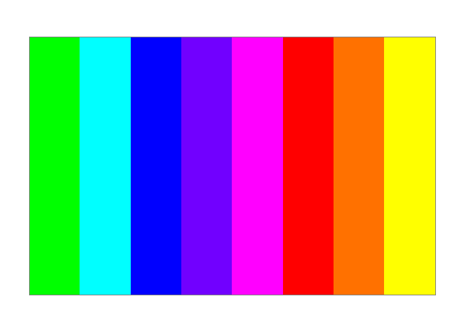

<!-- README.md is generated from README.Rmd. Please edit that file -->

# splashr

<!-- badges: start -->

<!-- badges: end -->

`splashr` brings [TodePond’s Splash color
system](https://www.todepond.com/lab/splash/) to R.

Splash represents colors as **3-digit numbers** (`RGB`), where each
digit is a channel from `0` to `9`. There are exactly 1000 Splash colors
(`000` = black, `999` = white, `900` = red, `090` = green, `009` = blue,
…). The format is human-readable, computer-readable, and intentionally
restrictive — it helps you stop fussing over the “perfect” color.

`splashr` converts Splash codes to hex strings you can drop straight
into plots, and supports **themes** (custom channel mappings, including
TodePond’s own pastel “Cellpond” palette).

## Installation

You can install the development version of splashr from
[GitHub](https://github.com/) with:

``` r
# install.packages("pak")
pak::pak("LoonanChauvette/splashr")
```

## Getting started

``` r
library(splashr)

# A single Splash color
splash("900")
#> [1] "#ff0000"

# Several at once
splash(c("900", "090", "009"))
#> [1] "#ff0000" "#00ff00" "#0000ff"

# Numeric codes are zero-padded
splash(c(900, 90, 9))
#> [1] "#ff0000" "#00ff00" "#0000ff"

# By name (theme-aware)
splash("green")
#> [1] "#00ff00"
```

### Wildcards: 10-color ramps along one channel

A `_` in a code marks the channel that varies `0` to `9`, giving you a
10-step ramp that stays inside the Splash system:

``` r
splash("9_9")   # red=9, blue=9, green varies 0..9
#>  [1] "#ff00ff" "#ff1cff" "#ff38ff" "#ff55ff" "#ff71ff" "#ff8dff" "#ffaaff"
#>  [8] "#ffc6ff" "#ffe2ff" "#ffffff"
```

### Themes

Themes define how the 0–9 digits map to 0–255 channel values, and which
color names are available. Two themes ship with the package: `"default"`
(linear mapping) and `"cellpond"` (TodePond’s personal pastel palette).

``` r
splash_themes()
#> [1] "cellpond" "default"

# Same name, different hex across themes
splash("green")
#> [1] "#00ff00"
splash("green", theme = "cellpond")
#> [1] "#17ff80"

# Define your own
splash_theme(
  "high-contrast",
  r = seq(0, 255, length.out = 10),
  g = seq(0, 255, length.out = 10),
  b = seq(0, 255, length.out = 10)
)
```

### Palettes for plotting

`splash_palette()` returns ready-to-use hex colors from the theme’s
named backbone — drop them straight into `col =` or a scale:

``` r
splash_palette(4)
#>     green      blue       red    yellow 
#> "#00ff00" "#0000ff" "#ff0000" "#ffff00"
splash_palette(4, theme = "cellpond")
#>     green      blue       red    yellow 
#> "#17ff80" "#17aeff" "#ff6262" "#ffff46"
```



### Round-tripping with `as_splash()`

`as_splash()` converts hex back to the nearest Splash code, respecting
the theme so round-trips are stable:

``` r
as_splash("#ff0000")
#> [1] "900"
as_splash(splash("407"))   # round-trip
#> [1] "407"
```

## Further reading

- [The Splash color system
  (TodePond)](https://www.todepond.com/lab/splash/)
- `?splash`, `?splash_palette`, `?splash_theme` for full API docs
